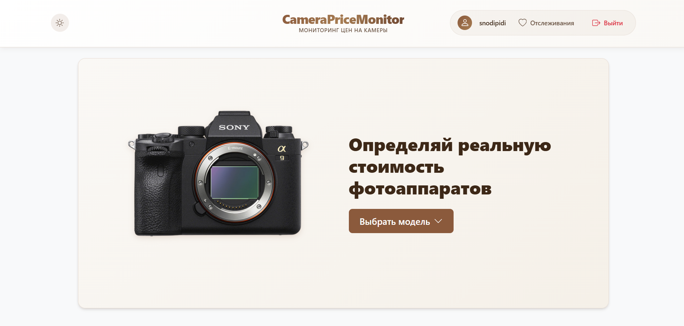
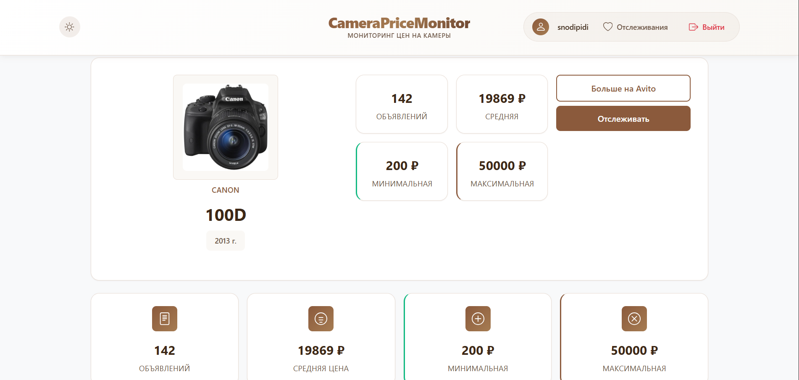
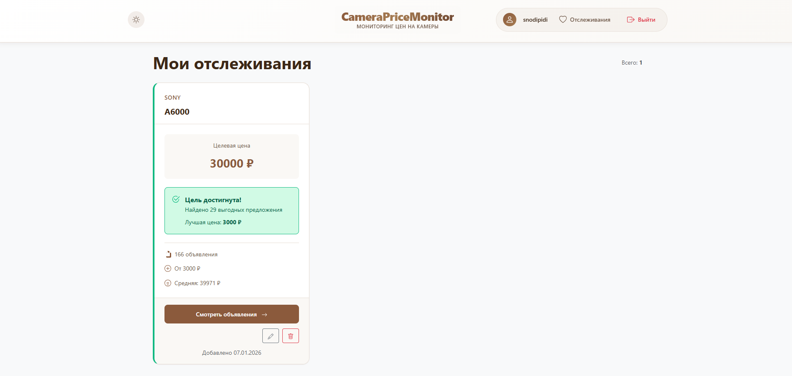

# CameraPriceMonitor

Сервис для мониторинга цен на подержанные фотоаппараты. Помогает покупателям и продавцам определять рыночную стоимость конкретной модели, находить выгодные предложения и отслеживать динамику цен на основе данных с площадки Avito. Позволяет установить целевую цену на модель камеры и получить уведомление, когда цена упадет.

**Ссылка на рабочий проект:** [https://snodipidi.pythonanywhere.com](https://snodipidi.pythonanywhere.com)

## Технологии

* **Python 3.10+**
* **Django 5.2.9**
* **Pandas 2.2.3** (расчет средних цен, статистика)
* **Plotly 5.24.1** (отрисовка интерактивных графиков)
* **NumPy 2.1.3**
* **Bootstrap 5.3**
* **SQLite** (база данных)

## Скриншоты


*Каталог моделей камер с базовой информацией о ценах и количестве объявлений*


*Детальная информация о модели: графики динамики цен, статистика, список объявлений*


*Персональный список отслеживания с индикацией достижения целевой цены*

## Как запустить проект локально

1. **Клонируйте репозиторий:**
   ```bash
   git clone https://github.com/ваш-юзернейм/CameraPriceMonitor.git
   cd CameraPriceMonitor
   ```

2. **Создайте и активируйте виртуальное окружение:**
   ```bash
   python -m venv venv
   source venv/bin/activate  # для Linux/Mac
   venv\Scripts\activate     # для Windows
   ```

3. **Установите зависимости:**
   ```bash
   pip install -r requirements.txt
   pip install beautifulsoup4 lxml playwright
   playwright install chromium
   ```

4. **Выполните миграции:**
   ```bash
   python manage.py migrate
   ```

5. **Создайте суперпользователя (опционально):**
   ```bash
   python manage.py createsuperuser
   ```

6. **Запустите сервер:**
   ```bash
   python manage.py runserver
   ```

7. **Откройте проект в браузере:**
   Перейдите по ссылке: http://127.0.0.1:8000/
